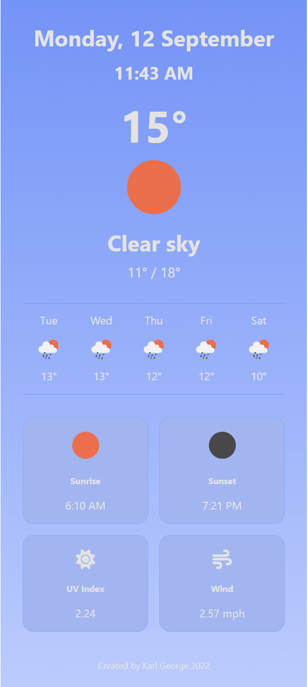

# Weather Forecast App

A weather forecast app that uses the users location to provide the weather forecast over the next 6 days for that area. Developed using React, HTML, CSS and consumes OpenWeatherAPI.

## Install Dependencies

Use `npm install` to install required dependencies.

